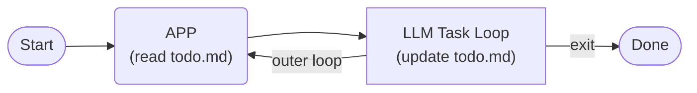
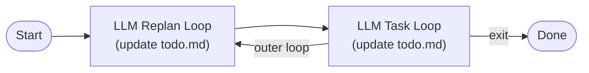

# Todo Mode (Plan-Execute with Handover)

When a job is too large for a single LLM context, split it into a plan of tasks in `./todo.md`: the application executes the tasks one-by-one, with a fresh LLM context per task, and carries state forward through the file. `-t` modes run in batch mode: they do not wait for a typed query - they read `./todo.md` and start executing immediately. There are two modes: **Static Plan** (`-t 1`), where the plan is fixed, and **Dynamic Replan** (`-t 2`), where the LLM rewrites the plan before each task. Mode 2 uses two LLM roles, each in its own fresh context: the replan planner (reviews and rewrites the plan) and the task executor (carries out each task).

## The Two Modes at a Glance

| | Mode 1: Static Plan | Mode 2: Dynamic Replan |
|---|---|---|
| Startup flag (`-t`) | `1` | `2` |
| When to use | Steps are fully known in advance | Steps are unknown or may change (exploration, research) |
| The plan (`todo.md`) | Fixed - the tasks run in order as written; the application marks each task `[x]` when it finishes | Living - starts from your Goal and initial task list; the LLM rewrites it before each task (add / remove / reorder / split) and marks each task `[x]` when it finishes |
| Handover files for the fresh LLM | The application appends each task's report to `artifacts/handover.md` | Same, plus the planner's notes; Mode 2 only: the planner also writes `./next-task.md` (the next task's brief, distilled from `artifacts/handover.md` for the executor) |

### Mode 1: Static Plan


<p align="right"><sub>Each rectangular box represents a fresh LLM instance with no prior context, handed over via handover.md.</sub></p>

### Mode 2: Dynamic Replan


<p align="right"><sub>Each rectangular box represents a fresh LLM instance with no prior context, handed over via handover.md.</sub></p>

## Before You Run: Writing `./todo.md`

Create `./todo.md` before starting - it is the job's plan, and the application reads it mechanically, so stick to these formats:

- `# <title>` - the run's label, shown in the console; keep it to one short line.
- `## Goal` - the job's objective, for the LLM.
- `## Tasks` - the work items, machine-read: one `- [ ] <task>` per line.
- `## Deliverables` (optional) - the goal files the job must produce, machine-read: `- artifacts/<name>`, one path per line.
- `artifacts/handover.md` is optional: the application seeds it with a template when missing and never overwrites an existing file. It is the free-form log that carries state across the fresh LLM contexts - Mode 1 tasks and the Mode 2 planner read it first.
- Do not hand-edit `./todo.md` after startup: in Mode 2 the replan planner owns it, in Mode 1 the application marks tasks `[x]`.

### Example `./todo.md` (with `## Deliverables`)

```markdown
# Report Generation

## Goal
Write a final report from the research notes.

## Tasks
- [ ] Research and save notes to artifacts/notes.md
- [ ] Merge the notes into artifacts/final-report.md

## Deliverables
- artifacts/final-report.md
```

## Mode 1: Static Plan

The plan is fixed before execution starts. You write the complete `./todo.md`; the application executes the tasks strictly in order, one per fresh LLM context, and marks each task `[x]` when it finishes, appending the task's final report to `artifacts/handover.md`. The AI never changes the plan itself. If execution is interrupted, rerunning `-t 1` resumes from the first unchecked task.

### Example: Fixed Sequence (all steps known in advance)

A typical Mode 1 case: a simple, fully-specified workflow with no unknowns.

#### 1. Create `./todo.md`

```markdown
# Counter Test

## Goal
Count from 1 to 3, recording each number in order.

## Tasks
- [ ] Write "1" to artifacts/count.txt
- [ ] Append "2" to artifacts/count.txt
- [ ] Append "3" to artifacts/count.txt

## Deliverables
- artifacts/count.txt
```

#### 2. Run

```bash
cargo run -- -t 1
```

What happens:

1. The application reads `./todo.md` (and `artifacts/handover.md`, creating it if missing) and picks the first unchecked task.
2. It executes that task with a fresh LLM context, then marks it `[x]` and appends the task's Handover Report to `artifacts/handover.md`.
3. It repeats for the next task, until all three are `[x]`.
4. When all tasks are `[x]`, it checks the goal deliverables (the files listed in the optional `## Deliverables` section) and prints a completion report as the job's final answer, listing the goal deliverables and the tasks' own output files separately. Then it exits.

## Mode 2: Dynamic Replan

The plan may change while the job runs. You write the Goal and an initial task list in `./todo.md` (it may be incomplete or wrong); before each task the LLM reviews and rewrites the plan - adding, removing, reordering, or splitting tasks - and marks tasks `[x]` as they finish (it may add subtasks). Each task session may only mark its own task `[x]` and add subtasks it discovered; the application validates every `./todo.md` write against that. Task reports and planner notes are all appended to `artifacts/handover.md` - never into `./todo.md` - and only the application writes them. If execution is interrupted, rerunning `-t 2` resumes from the first unchecked task.

### Example: Missing Task Discovery (plan is incomplete; the AI fills the gap)

Shows the replan step in action: the `## Deliverables` section requires two files, but the Tasks list only creates one. The LLM notices the gap and adds the missing task.

#### 1. Create `./todo.md`

```markdown
# Two-File Creation

## Goal
Create two text files with the contents "hello" and "world".

## Tasks
- [ ] Create artifacts/one.txt with content "hello"

## Deliverables
- artifacts/one.txt
- artifacts/two.txt
```

#### 2. Run

```bash
cargo run -- -t 2
```

What happens:

1. Replan. The application starts a fresh planner session: the planner reads `./todo.md` and `artifacts/handover.md` (creating it if missing), checks the files named in recent `outputs:` lines, then rewrites `./todo.md` - here it notices `artifacts/two.txt` is missing and adds the task - and overwrites `./next-task.md` with the brief for the next task. Its plan-update notes are appended to `artifacts/handover.md` as a `- Planner:` entry.
2. Execute. The application runs the first unchecked task in a fresh LLM context. The task session reads `./todo.md` and `./next-task.md` first (it may explore `artifacts/` if the brief is insufficient), creates both files, and marks its task `[x]` in `./todo.md`. Its Handover Report is appended to `artifacts/handover.md`.
3. Repeat. The replan-execute cycle continues until all tasks are `[x]`. When that happens, one final replan runs so the planner can still add tasks if the Goal is not yet achieved; the loop exits only when the plan is still all-`[x]` after it.
4. The application checks the goal deliverables on disk, lists goal deliverables and task outputs separately in the completion report, and exits.

Safety: replanning must make progress. If the unchecked-task count does not shrink for `--max-replan-attempts` consecutive rounds (default 3, `0` = unlimited), the application stops. A replan LLM error is retried once; if the retry also fails, the task is skipped that round and the failure counts as a stall.

### Example: RFC-Compliant Mini Mail Server (complex, multi-file project)

A realistic Mode 2 case: a multi-module Rust project with hard technical constraints, where the exact implementation details (protocol parsing edge cases, storage layout, test scaffolding) are best discovered by the LLM as it works, rather than fully specified up front.

#### 1. Create `./todo.md`

```markdown
# Mini Mail Server Implementation (RFC 5321 & RFC 3501)

## Goal
Build a concurrent local mail server in Rust that handles SMTP reception and IMAP retrieval based on official RFC specifications, designed with a fully isolated architecture to run end-to-end integration tests without any external network access.

**Hard constraint**: all tests must run against local loopback (`127.0.0.1`) only — never connect to real internet mail servers or external SMTP/IMAP endpoints.

## Tasks
- [ ] Implement the SMTP protocol parser and transaction state machine based on RFC 5321 using local in-memory streams.
- [ ] Implement the IMAP4rev1 protocol command handlers and session states based on RFC 3501 using loopback buffers.
- [ ] Implement a concurrent Maildir-based storage engine in src/storage.rs using a localized temporary directory fixture, ensuring zero network calls or external socket dependencies.
- [ ] Write end-to-end local integration tests using loopback TCP listeners (`127.0.0.1:0`) and mock client drivers to simulate a full offline cycle of sending and reading mail.

## Deliverables
- Cargo.toml
- src/smtp.rs
- src/imap.rs
- src/storage.rs
- tests/integration_test.rs
```

#### 2. Run

```bash
cargo run -- -t 2
```

What happens:

1. **Replan before each task.** The planner reads the Goal, reviews the current plan, and may rework it as technical constraints surface. For example, after the SMTP task reveals that `Cargo.toml` must declare `tokio` and `maildir` dependencies, the planner may split the storage task into "define the `Mailbox` trait" and "implement Maildir backend", or reorder tasks if a dependency is discovered (e.g. integration tests require all three modules to compile first).
2. **Execute each task.** Each executor session reads `./next-task.md`, explores `artifacts/handover.md` for context from prior tasks, then produces one or more of the target files. After the SMTP task completes, its handover report documents the public API of `smtp.rs` so the IMAP executor knows which `Storage` trait to call into.
3. **Deliverables gating.** After all tasks are `[x]`, the application verifies that every file listed under `## Deliverables` exists on disk. If `tests/integration_test.rs` is missing (e.g. the last task ran out of output tokens), the job is reported as failed and the user can rerun `-t 2` to resume from the unchecked task.

Why Mode 2 fits here: the exact protocol handling, error recovery strategy, and test harness design emerge as the LLM encounters implementation details. A static plan would risk locking in a wrong decomposition before any code is written.

## Internals

How state flows under the hood: which files carry it, who may write them, and the remaining machine-format rules. Hand-editing these files breaks the run.

Mode 2 uses two LLM roles, each in a fresh context: the replan planner, which reviews and rewrites the plan (`./todo.md`, `./next-task.md`), and the task executor, which carries out each task. Mode 1 uses only the task executor.

### Files and Ownership

| File | Role | Written by | Read by |
|---|---|---|---|
| `todo.md` | the plan (Goal / Tasks / Deliverables) | Mode 2: replan planner and task executor; Mode 1: the application | every session |
| `next-task.md` | per-task brief (Mode 2 only) | the replan planner | the task executor |
| `artifacts/handover.md` | task reports and planner notes | the application (append only) | the replan planner |
| `artifacts/calc_ledger.jsonl` | calc tool result ledger | the calc tool (append only) | citation verification (`[C-XXXX]`) |
| session files | per-session conversation history | the application | resuming after an interruption |

### Additional Format Notes

- Only `artifacts/` paths are extracted from a report's `Output:` line and recorded on the `outputs:` line; other declarations (e.g. `todo.md (updated)`) are ignored.
- `## Deliverables` lists the job's goal deliverables; at completion every listed path must exist on disk (a missing or empty one fails the job). A plan without the section declares none and is not gated (`## Goal` prose is never read).
- The `outputs:` lines record the tasks' own outputs (task outputs); they are verified too, but a missing one is warned about, not fatal. The completion report lists the two separately: `deliverables(M): ...` (goal deliverables) and `task outputs(T): ...` (task outputs beyond the goal list).
- In Mode 2, LLM writes to `artifacts/handover.md` and `artifacts/calc_ledger.jsonl` are rejected at the tool layer (reads stay allowed); completion reports are appended automatically.
- In Mode 2, the task executor's `./todo.md` updates are validated before they land: it may mark only its own task `[x]` and add subtasks (checked or unchecked). Any other change - flipping, renaming, removing, or reordering existing tasks, or touching other sections - is rejected with `[TOOL_DENIED]` and the executor corrects and retries. `./next-task.md` is not writable by the executor (planner-owned). The replan planner's own `./todo.md` writes are not restricted.
- The machine formats are the contract (`Output:` is comma-separated, `## Deliverables` is one path per line); anything written outside the formats is taken as written, so stick to the format.
- Sloppy formatting is tolerated: tabs or extra spaces, alternative bullet markers (`*`, `+`, `・`, `•`), Tasks-style checkboxes, and a space before the colon in `Output:` are all read as the same line.
- In todo mode, the `-q` query is appended to every replan and task session's user message as additional instructions.
